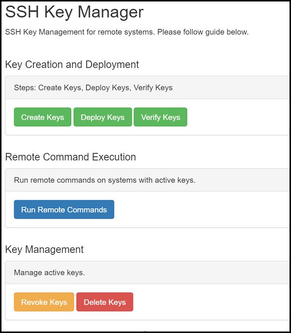

PHP SSH Key Management
======================

This package is used to distribute SSH keys (using PHP) to remote servers.

Why is this useful?
-------------------
If you want to run commands on external servers, you usually need daemon's of some kind running to listen for requests.
Given that our world is moving to web based applications, remote commands are usually done from web servers and not local bash/scripting.

Therefore, this package uses PHP to create/install keys on remote servers running under the user specified using SSH RSA keys.

Screenshot?
-----------

Software Dependencies
---------------------
 * PHP 5 or greater
 * PHPSECLIB 1.0.2 (http://phpseclib.sourceforge.net/)
 
 
Things to note
--------------
When creating RSA key pairs, the phpseclib uses entropy on server to generate the keys. Should your server be idle or not have much activity - generating keys may take some time.
For example, generating a 2048-bit key could take longer than 30 seconds - which is the default timeout for SSH commands built into phpseclib.

To make your server generate these keys faster, you can install the following PHP packages:
php5-gmp

This will greatly decrease your key generatation time.

**The user that is running the apache server, generally the "wwwrun" user, will will need write access to the save location for the public/private keys.

Legal
-----
This is completely, 100% not production ready. I'm only using for testing/development purposes only.
If my code breaks your system - not my fault. :D
